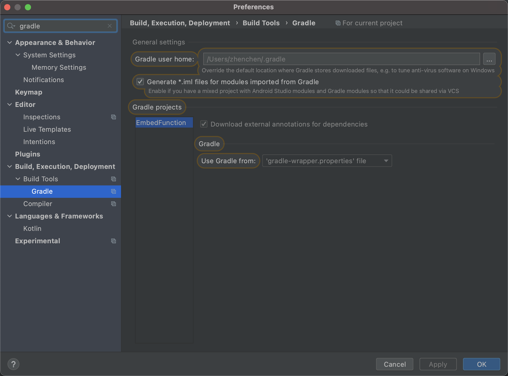
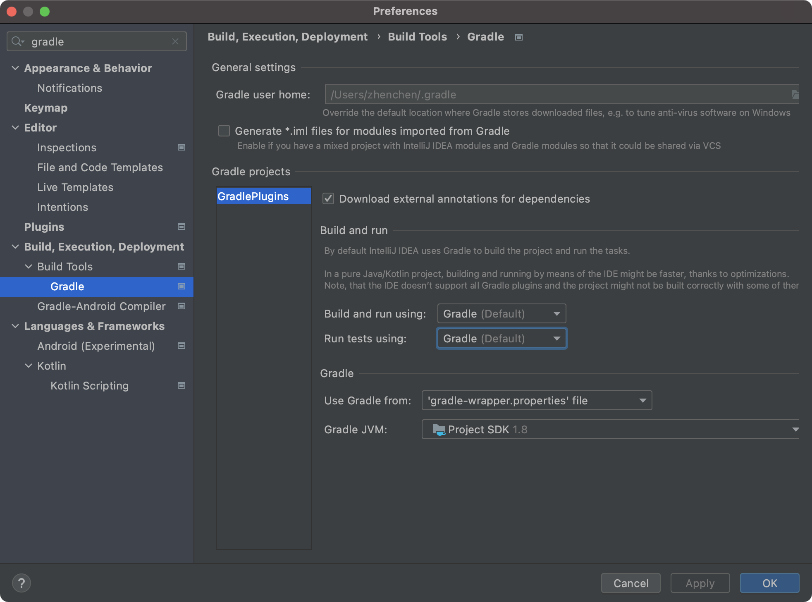
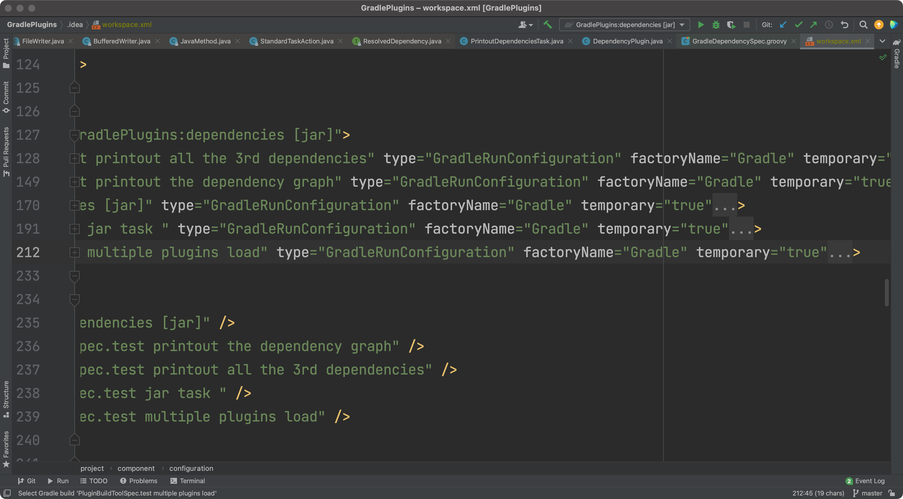
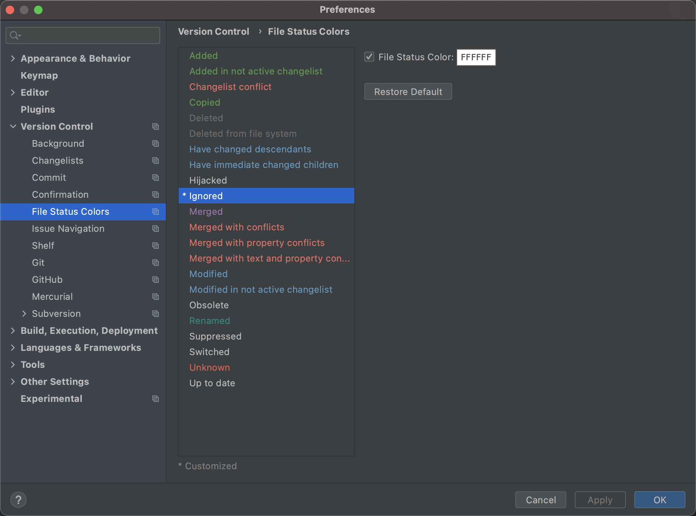

## Readme

### The project structure
* api The common API
* app The test android project
* cache The java-library used for us to build a test jar
* compile-merge The Gradle plugin helps us merge the class diff while we are compiling the source code

### Some testcase for us to test how the Gradle plugin:compile-merge works

* ChangeFileInJarSpec: 
  Test how to modify a class from the jar file.
* MergeClassesSpec: 
  Test how to merge two classes files.
* ReplaceClassesSpec:
  "test find decorate class from file": test how we use ASM to find the decorated class.
  "test replace method": Test how we collect all the decorated classes.
  "test merge class change to source class": Test use the decorated mode to change merge the two classes
* CompileMergeSpec:
  "test the compile merge plugin": Test how the compile merge Plugin works

If you want to test all the test cases, You will need to import the project with IDEA
The reason is the IDEA could allow us to configure the Test engine.
The pictures below tells you why we need to change it.
First is AS do not support the Gradle Runner.





However, We allow to change the configuration manually.




### About the .extensions
The folder: install is for us to install the env for the extension.
The folder: plugin_libs is where we manage the gradle plugins. It will put all the jar files into the gradle classpath automatically.
The folder: scripts is the folder where we extend the Gradle. All the script files you put in it will execute before the gradle task is start.

So we will have an extra env to change the project without ruin the existed project.

Another problem, Since we put our extensions into the global gitignore file. We may want to change the git file status colors.




### How to start
* Copy the app_extension to your project.
* Execute the script: .extensions/script/app_extension_install.sh

That's it.

### How to modify your code.
For example change our activity

```
//main:/jack.andorid.embedfunction.InternalClass
//This is a internal class, we should access it in the same package. 
class InternalClass {
    public void testFunction(){
        System.out.println("Hello world");
    }
}

//main:/jack.andorid.embedfunction.MainActivity
class MainActivity : AppCompatActivity() {
    override fun onCreate(savedInstanceState: Bundle?) {
        super.onCreate(savedInstanceState)
        setContentView(R.layout.activity_main)
    }
}
```

The decorated class

```
//This annotation class tells us which class we want to decorate.
@Decorate(target = MainActivity::class)
class MainActivity_Decorated : AppCompatActivity() {
    //We will overwrite the whole function.
    override fun onCreate(savedInstanceState: Bundle?) {
        super.onCreate(savedInstanceState)
        setContentView(R.layout.activity_main)
        findViewById<View>(R.id.text_view).setOnClickListener {
            //Noticed here: That we are access the internal class.
            InternalClass().testFunction()
            Toast.makeText(applicationContext,"Test",Toast.LENGTH_SHORT).show()
        }
    }
    
    //This method will be add to the MainActivity
    fun add(){
        InternalClass().testFunction()
    }
}
```

* How to enable the Gradle init-script
    1. Use command parameter for example：gradle --init-script yourdir/init.gradle -q taskName
    2. Put the init.gradle file to USER_HOME/.gradle/
    3. Put the script file (.gradle) to USER_HOME/.gradle/init.d/
    4. Put the script file (.gradle_) to GRADLE_HOME/init.d/

## References
*[asm-transformations](https://lsieun.cn/assets/pdf/asm-transformations.pdf)
